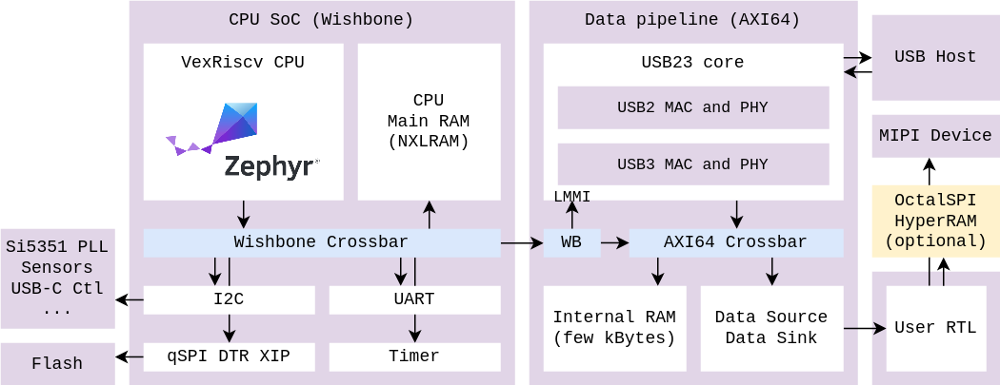

# RTL Reference Design

- The USB core requires fast access to a small local memory where TRB's can be stored and retrieved.
- Any USB transactions (enumeration, CDC, other low bandwidth tasks) can use as a local scratch space where endpoint data is located.
For any higher bandwidth transfer, a full AXI64 slave is utilized that allows for fast transfer that can support the high bandwidth required to keep the USB pipe running without being throttled.



To build this component, refer to the
[RTL build instructions](https://github.com/tinyvision-ai-inc/tinyCLUNX33/blob/main/RTL/README.md).


## Data Pipeline (AXI64)

The user does not need to customize this part, although it is possible.

External ports:

- **Wishbone port** for a CPU to access the internal AXI64 crossbar.

- **AXI64 port** for connecting custom RTL producing/consuming the USB data,
  integrated as an AXI slave, with FIFO/Stream adapters available.

Internal AXI64 cores:

- **USB23 bus master** performing AXI bus requests for transferring data to the
  USB host, from the address indicated by the CPU.

- **Small block of RAM** for the CPU to store small buffers for use by the
  USB23 core.


## CPU SoC (Wishbone)

The user does not need to customize this part, although it is possible.

External ports:

- **Wishbone port** so that the CPU can control an external bus, for use with
  the Data Pipeline's Wishbone port seen above.

- **Hardware interfaces** such as I2C, UART, qSPI, GPIO.

Internal Wishbone cores:

- **[VexRiscv](https://github.com/SpinalHDL/VexRiscv)** CPU, controlling the
  peripherals, configuring their configuration registers over Wishbone.

- **Main CPU RAM** controller, memory-mapped to the Wishbone bus for use by the CPU and its firmware.

- **qSPI DTR Flash** controller, memory-mapped to the wishbone bus so that the CPU
  can execute its firmware from flash (XIP). See [SoC Flash](soc_flash.md).

- **Timer** controller, used as systick by the Zephyr RTOS.

- **I2C** controller, used to program the external [Si5351 PLL](som_clocks.md),
  MIPI image sensors, USB-C port controller, or anything else connected to I2C.

- **UART** controller, used for printing debug logs or configuration shell.

- **Extra peripherals** can be integrated to support external SoCs.


## User RTL

The interface for moving large amounts of data from custom RTL to the USB core
is a standard AXI64 slave.
Specific configuration and addresses for AXI access are controlled by the corresponding USB endpoint configuration in the Zephyr driver.

Helper cores available MIPI/USB/RAM:

- **Wrappers around the AXI64 port** offering a FIFO or Stream based interface
  rather than an AXI one.

- **OctalSPI and HyperRAM** controllers for facilitating the access to this
  external chip on the *Compute* variant.

- TODO: pixel, MIPI and image data processing utilities.


## Usage Statistics

Early estimation of the complete resource usage for a demo project performing.

These will vary a lot as the project will evolve, either up or down.

```
Device utilization summary:

   VHI                   1/1           100% used
   SIOLOGIC              3/52            6% used
   DCS                   1/1           100% used
   EBR                  18/64           28% used
   MULT9                12/128           9% used
   MULT18                6/64            9% used
   MULT18X36             2/32            6% used
   REG18                10/128           8% used
   PREADD9              12/128           9% used
   LRAM                  1/5            20% used
   DIFFIO18              6/16           38% used
                         6/16           37% bonded
   IOLOGIC               7/32           22% used
   SEIO18               15/32           47% used
                        15/32           47% bonded
   SEIO33               11/51           22% used
                        11/19           58% bonded
   ECLKDIV               2/12           17% used
   ECLKSYNC              2/12           17% used
   OSCD                  1/1           100% used
   PLL                   1/1           100% used
   APIO                 10/16           63% used
   USB23                 1/1           100% used
   SLICE              8331/13824        60% used
     LUT              7727/27648        28% used
     REG              4379/27648        16% used
```
