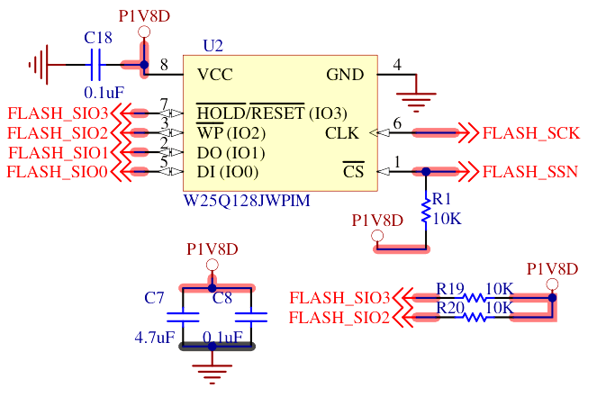

# SoM Flash

A 16 MByte (128 Mbit) QSPI flash with Dual Transmission Rate (DTR) can store the
FPGA bitfile as well as a storing the firmware that the soft CPU core can
execute in-place (XIP).


In the default RTL, the flash is mapped at address `0x2000_0000`.

```
0x2000_0000 -- First address of FPGA bitfile
0x2010_0000 -- First address of Zephyr firmware (optional)
0x20*0_0000 -- Free area at the end of the flash for custom
```

The command [`ecpprog`](https://github.com/gregdavill/ecpprog) permits to send
a bitfile to the SoM by using the FTDI present on the
[BaseBoard](carrier_baseboard.md).

It can be installed as part of
[OSS Cad Suite](https://github.com/YosysHQ/oss-cad-suite-build#installation)
then called this way:

```
ecpprog -o 0x000000 file_to_program.bin
```

The `-o 0x000000` can be adapted to any local offset *within* the flash,
to allow multiple binary images to cohabitate.

The regular Radiant programmer can also be used as usual for Lattice parts.


## Hardware integration

The flash is already integrated internally in the SoM hardware.

In addition, its qSPI interface may be accessed from the outside, for debugging
or other purpose: 4 SPI data lines in half-duplex for 4x the
throughput.

It further provides Double Transmission Rate (DTR, also known as DDR) to send
twice the amount of data per clock.


## RTL integration

TODO: add the new QSPI DDR flash controller and map it to AXI for XIP

TODO: hook the QSPI bus as a regular SPI peripheral


## Zephyr integration

Inside the flash, the Zephyr firmware is written at offset `0x0010_0000`.

So the final start address of the Zephyr firmware is `0x2010_0000`.

This is integrated into the Zephyr DeviceTree as a flash controller entry:

```
flash0: flash@20100000 {
	reg = <0x20100000 0x100000>;
	compatible = "soc-nv-flash";
	status = "okay";
};
```


## Troubleshooting

This assumes that the [tinyCLUNX33 Devkit](carrier_devkit.md) is used for
accessing and programming the flash.


### IDCODE: 0x010fb043 does not match

The `ecpprog` tool might show error messages about the `IDCODE` not being recognized.
The LIFCL-33U FPGA part [not yet integrated](https://github.com/gregdavill/ecpprog/pull/20) into `ecpprog`.
This is not a problem, the tool should still work besides this.
If it does not, there is likely an unrelated error happening.

It is possible to test that the `ecpprog` tool can access the FPGA part:

```
$ ecpprog -t
init..
IDCODE: 0x010fb043 does not match :(
flash ID: 0xEF 0x70 0x18
Bye.
$
```

### IDCODE: 0xffffffff does not match

If at the opposite, you see an IDCODE of `0xffffffff`, this means that the FPGA
was not detected at all from the SoM.

The FTDI chip was still recognized, which suggest that something went wrong
between the FTDI programmer chip on the Devkit carrier board and the FPGA.

This can happen if the connector are not fully inserted, damaged signals,
a faulty or incompatible flash part ended-up on the module you own...

If unplugging/replugging the SoM makes any difference,
this suggest there is some problem the connector only.


### IDCODE: 0x(something else) does not match

If anything else is returned, maybe there was a transmission error, degrading
the signal as it travels between the FTDI and the FPGA.

Same applies for the "flash ID" and "IDCODE".
You can test to run the tool slower:

```
$ ecpprog -s -t
init..
IDCODE: 0x010fb043 does not match :(
flash ID: 0xEF 0x70 0x18
Bye.
$
```

If you see something different than earlier, it means there was some transmission issues and running slower is a temporary fix.


### Can't find iCE FTDI USB device

This message from `ecpprog` means it cannot recognize the FTDI progrrammer
present on the Devkit.

```
$ ecpprog -t
init..
Can't find iCE FTDI USB device (vendor_id 0x0403, device_id 0x6010 or 0x6014).
ABORT.
$ 
```

It is a matter of allowing this tool to access the driver.

On Linux, you may need to add your current user to a group (which you can find
with `ls -l /dev/ttyUSB*`, such as `plugdev`) with a command such as
`sudo usermod -aG plugdev "$USER"`, then logging off and on again.

On Windows, you may need to change the driver Windows selected with Zadig
so that `ecpprog` can have a direct access, as
[documented by libusb](https://github.com/libusb/libusb/wiki/Windows#driver-installation)
that `ecpprog` uses under the hood.


### Probing the flash

To investigate further, it is possible to read what the flash using the 
flash debug header of the [tinyCLUNX33 Devkit](carrier_devkit.md).
These would allow to connect a logic analyzer and dump the SPI signals as the
FTDI operates.

If you need to go this far, it is probably up to tinyVision.ai to investigate
instead of yourself, as there might be something wrong with the hardware
you received.

If not signal is visible at all, something might have gone wrong with the FTDI:
is another device containing an FTDI connected to your workstation?


## Parts featured

- Winbond
  [W25Q128JW_DTR](https://www.winbond.com/hq/support/documentation/downloadV2022.jsp?__locale=en&xmlPath=/support/resources/.content/item/DA00-W25Q128JW_1.html&level=1)
  QSPI DTR flash


