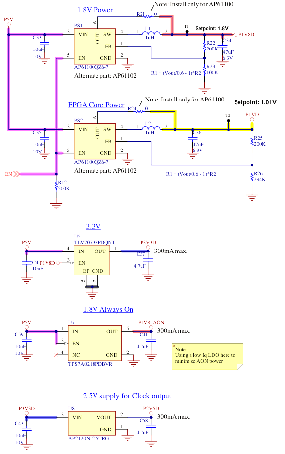

# SoM Power

The SoM uses a single source of power at 5V, and exports several power rails
at lower voltage using LDO and Buck converters.

The SoM supports turning all power rails off, except a single Always ON (AON)
rail, only powering one power domain of the FPGA.

This allows staying in a deep sleep state until custom logic wakes the SoM.

## Rationale

One of the highest power usage is the FPGA fabric and its `P1VD` core power rail.
This is the reason for the use of an efficient Diodes AP61102 buck converter for
this rail.

To reduce it further, the FPGA chip features an Always ON (AON) power domain,
able to keep a small part operating while the rest goes entirely to sleep.

This small internal Always ON domain allows the user to write custom logic for
waking up the rest of the FPGA, as well as the rest of the SoM altogether,
to reduce the power usage to the bare minimum that this hardware is capable of.

The SoM can also export its various internal power rails to the user design so
that no extra LDO are required in the carrier board, or as reference voltage
for communication with the SoM.

## Hardware integration of Power Rail

The SoM generates various voltage level useable by the user design within the
current capability of the LDOs and buck converters.

| Name         | Voltage   | Current | EN pin | Type         | Derived from       |
| ------------ | --------- | ------- | ------ | ------------ | ------------------ |
| **P5V**      | 5.0 V     | max N/A | no     | Input power  | -                  |
| **P3V3D**    | 3.3 V     | max N/A | yes    | Output power | P5V with TLV707    |
| **P2V5D**    | 2.5 V     | max N/A | yes    | Output power | P3V3D with AP2120N |
| **P1V8D**    | 1.8 V     | max N/A | yes    | Output power | P5V with AP61102   |
| **P1V8_AON** | 1.8 V     | max N/A | no     | Output power | P5V with TPS7A021  |
| **P1VD**     | 1.0 V     | max N/A | yes    | Internal     | P5V with AP61102   |

- **P5V:**
  The only input power supply rail, typically coming from the power pins
  of the USB connector.

- **P3V3D:**
  Required by the FPGA, not used for any signal.
  Reused for deriving the 2.5V power rail out of it.

- **P2V5D:**
  Required for the Si5351 clock, not used for any signal.

- **P1V8D:**
  Required by the Flash and SRAM chips.
  If reused at the outside, this sets the I/O voltage level for these pins too.

- **P1V8_AON:**
  Required by the Always-On power domain, which stays on even when EN is low.
  Only for the FPGA to wake-up the rest.

- **P1VD:**
  Drawing most of the current to power the FPGA core.
  Not available to the outside.

## Hardware integration of I/O voltage levels

The SoM allows to provide external reference voltages, directly applied to the
FPGA I/O banks, thanks to 3 different pins used for different purposes at
different supported ranges:

| Bank      | Voltage Supply    | Pins                                        |
| --------- | ----------------- | ------------------------------------------- |
| USB VBUS  | From SoM at 5.0 V | USB3 SSTX+/- SSRX+/-, USB2 D+/-, REFCLK, EN |
| Bank 0    | From SoM at 1.8 V | GPIOs, Flash/SRAM, PROGN, AON in/out        |
| Bank 1    | 1.2 V to 3.3 V    | GPIOs, JTAG, I2C                            |
| Bank 2    | 1.2 V to 1.8 V    | Connectivity SoM variant differential pairs |
| Bank 3    | 1.2 V to 1.8 V    | 6 differential pairs                        |

## RTL integration

TODO: Describe the GPIO controller pin in use.

## Zephyr integration

TODO: Describe the pinctrl DeviceTree integration.

## Parts featured

- Diodes [AP61102](https://www.diodes.com/assets/Datasheets/AP61100-AP61102.pdf) buck converter
- Diodes [AP2120N](https://www.diodes.com/assets/Datasheets/AP2120.pdf) LDO
- Texas Instrument [TLV707](https://www.ti.com/lit/ds/symlink/tlv707.pdf) LDO
- Texas Instrument [TPS7A02](https://www.ti.com/lit/ds/symlink/tps7a02.pdf) nanopower LDO

