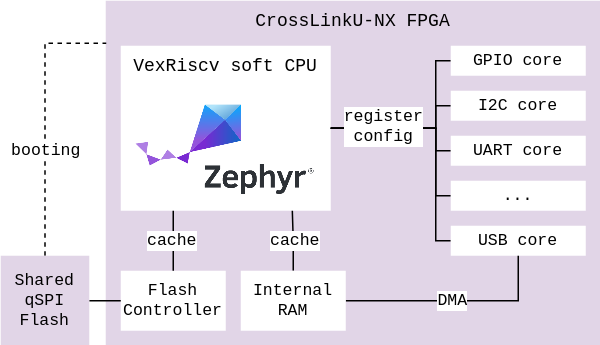

# Zephyr integration

The [Zephyr RTOS](https://docs.zephyrproject.org/) has been ported the SoM on
top of the [RTL Reference Design](rtl_reference_design.md), allowing to control
the USB core, configure the peripherals and external chis, as well as execute
custom application.

## Zephyr fork

[code](https://github.com/tinyvision-ai-inc/zephyr/tree/tinyclunx33)

An
[usb driver](https://github.com/tinyvision-ai-inc/zephyr/blob/tinyclunx33/drivers/usb/udc/udc_usb23.c)
is being implemented with the goal to be upstreamed in Zephyr.

An UVC device class is being implemented as well,
Zephyr sill missing support for it.

## Example project

[code](https://github.com/tinyvision-ai-inc/tinyclunx33_zephyr_example)

An example project is provided with build instructions in order to:

- Test the USB device driver, with an USB CDC and soon USB UVC interface

- Communicate with an UART (baud rate 115200) through the FTDI to get
  the debug logs, or send commands to the Zephyr shell (both through the
  same UART) such as an I2C scan or raw register writes.

- Act as a staring point for new firmware, updated to match the latest RTL
  and driver: same code tinyVision uses for writing and testing USB3.

## Debug logs and shell

The FTDI chip present on the Devkit provides ways to:

- [program the flash](som_flash.md)

- Access the soft CPU JTAG interface (work in progress, not ready yet)

- Access a debug UART interface (baud rate 115200)

These can be accessed by connecting an USB2 cable to the Debug USB interace
of the Devkit as described
[here](https://github.com/tinyvision-ai-inc/tinyclunx33_zephyr_example).

For users of different systems, it is possible to use any tool of your choice
supporting JTAG (for when it is ready) and UART.
